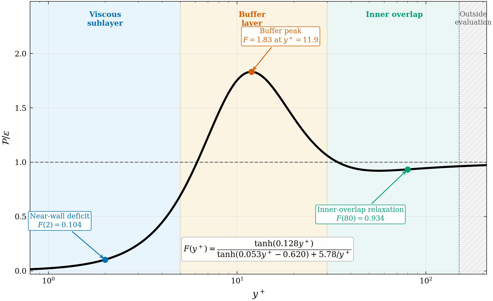
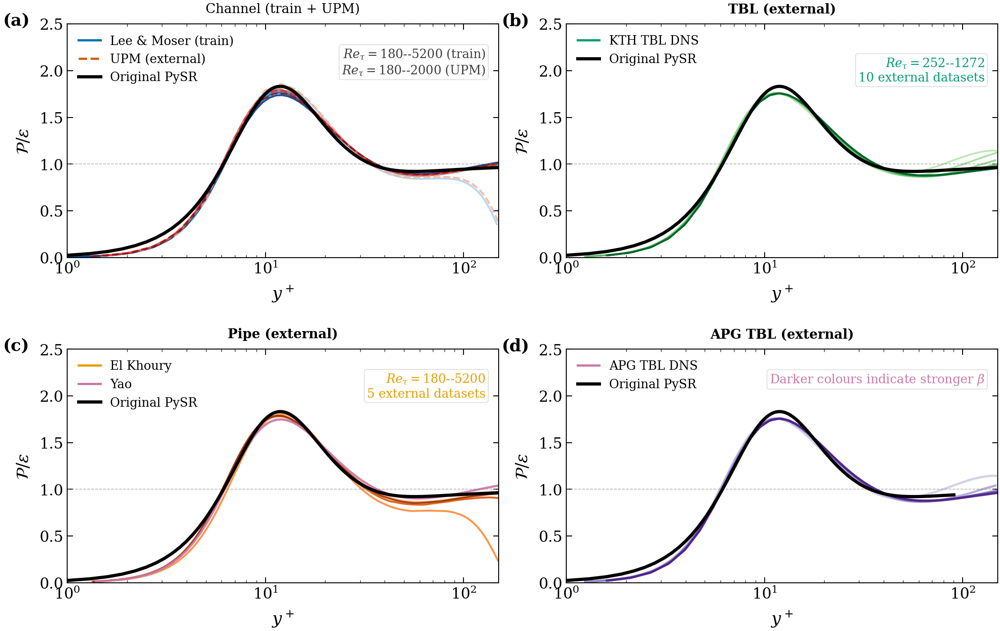

# Combining Symbolic Regression and Turbulence Physics to Develop a Compact Inner-Layer Production–Dissipation Closure

Code and data records for the article of the above title by **Jianou Jiang** and
**Budimir Rosic** (Department of Engineering Science, University of Oxford), accepted for
publication in *Physics of Fluids* (AIP Publishing) and selected by the Editors as a
**Featured Article**. Citation details (volume, pages, DOI) will be added here on
publication; the manuscript reference number is `POF26-AR-08545`.



*Figure 1 of the article: the near-wall turbulence problem addressed by the closure.*

## The closure

The recommended closure for the inner-layer production-to-dissipation ratio is

```
                 tanh(0.128 y+)
F_PySR(y+) = ---------------------------------
             tanh(0.053 y+ - 0.620) + 5.78/y+
```

on the domain `1 < y+ <= min(150, 0.3 Re_tau)` for incompressible, smooth-wall,
pressure-driven flows. A squared-numerator variant (the **M16** benchmark, coefficients
`0.111, 0.052, 0.443, 2.888`) enforces the exact kinematic cubic wall exponent and is
retained as a physics-constrained asymptotic benchmark. Known limitations are stated in
the article: accuracy deteriorates under strong adverse pressure gradients, the closure
is not an outer-wake model, and it fails out of domain on plane Couette flow.



*Figure 3 of the article: the production–dissipation ratio collapses onto the same
inner-layer curve across channel, pipe and boundary-layer flows.*

Ready-to-use implementation:

```python
from closure.pe_closure import f_pysr, f_m16, valid_domain

F = f_pysr(yplus)                 # recommended closure
mask = valid_domain(yplus, re_tau)
```

`python3 closure/pe_closure.py` prints a small reference table.

## Repository layout

- `closure/` — stand-alone NumPy implementation of the two printed formulas.
- `FORMULA_DECISION.md` — the formula-selection rule, its result, and the numerical
  basis (the exact paired comparison on the frozen manifest).
- `records/manifest/` — the frozen 179-row per-profile manifest with evaluation masks,
  source SHA-256 hashes and historical-exposure labels, the frozen wall-amplitude fit,
  and the full-suite evaluator that scores both formulas on identical points and masks.
- `records/audits/` — the paired formula-comparison loaders, the pressure-transport
  audit, and the wall-asymptote/attached-eddy contracts.
- `records/fitting/` — the matched-objective fitting method and its configuration.
- `replay/` — the replay driver and the four regenerated evidence records (paired
  formula comparison, matched-training diagnostic, pressure-transport audit,
  wall-asymptote/attached-eddy record).
- `audit/` — an independent clean-room recomputation of the printed-form decision, the
  direct channel/pipe dissipation diagnostic, and the pressure-transport sensitivity
  test.
- `supplementary/` — the STLSQ sparse-regression verification (script, results and
  figure), the bootstrap wall-exponent record, wall-weighted refit,
  adverse-pressure-gradient parsing and Pareto-ablation analyses, and the compact
  adverse-pressure-gradient budget records.
- `codes/analysis/` — figure-generation code for the article's validation figures.
- `figures/` — the two article figures shown above.
- `SHA256SUMS.txt` — checksums for the archived record files.

## Verify / replay

The compact records in this repository already contain every number quoted in the
article. To regenerate them from the underlying DNS/LES data, first stage the public
datasets (they are **not** redistributed here; each expected path and its SHA-256 digest
are recorded in `records/manifest/profile_manifest_freeze.json`, and the originating
research groups are credited and cited in the article):

- `codes/results/` — preprocessed profile archives (NumPy `.npz`) built from the public
  DNS/LES databases;
- `codes/data_processing/` — the downloaded budget tables and caches;
- `related_papers/` — the pipe-flow budget tables;
- `records/manifest/source_cache/` — the adverse-pressure-gradient source archive.

Then, with Python 3, NumPy and SciPy installed (see `requirements.txt`):

```bash
python3 replay/replay_evidence.py
python3 audit/recompute_clean_room_metrics.py
```

run from the repository root. The first command verifies every recorded source digest
and regenerates the four evidence records under `replay/results/`; the second
regenerates the clean-room audit. Regenerated files can be compared against
`SHA256SUMS.txt`.

## Citation

Until the DOI is assigned, please cite:

> J. Jiang and B. Rosic, "Combining Symbolic Regression and Turbulence Physics to
> Develop a Compact Inner-Layer Production–Dissipation Closure," *Physics of Fluids*
> (accepted, in production), POF26-AR-08545.

## Licence

The code and record files in this repository are released under the MIT Licence (see
`LICENSE`). The DNS/LES databases referenced by the manifest are the property of their
original providers and are not covered by this licence.
